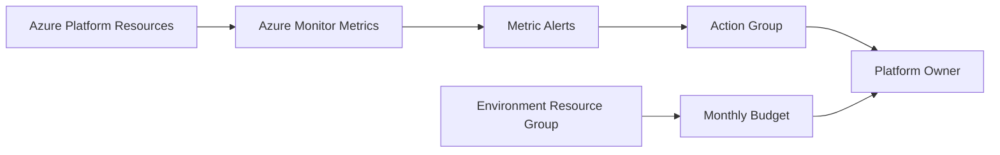

# Enterprise Azure Landing Zone Reference Architecture

## Release v1.9.0 — Operational Alerts and Automation

This release adds operational alerting, budget controls, and engineering utility scripts.

### Added

- Reusable Azure Monitor metric-alert module
- Reusable resource-group budget module
- Storage availability alerts
- Container Registry storage-usage alerts
- Optional monthly environment budgets
- PowerShell and Bash validation scripts
- Terraform cache cleanup scripts
- Operational alerting and cost-governance documentation

## Operational flow



## Portfolio-only operation

The repository can be validated without an Azure subscription:

```powershell
terraform fmt -check -recursive
terraform -chdir=environments/dev init -backend=false -reconfigure
terraform -chdir=environments/dev validate
```

Metric alerts and budgets require Azure resources and permissions only when planning or applying.

## Roadmap

- [x] v1.0.0 Repository foundation
- [x] v1.1.0 Documentation and standards
- [x] v1.2.0 Naming and resource groups
- [x] v1.3.0 Hub-and-spoke networking
- [x] v1.4.0 Shared platform services
- [x] v1.5.0 AKS platform
- [x] v1.6.0 Monitoring and diagnostics
- [x] v1.7.0 CI/CD reference workflows
- [x] v1.8.0 Private networking and security
- [x] v1.9.0 Operational alerts and automation
- [ ] v2.0.0 Integrated portfolio release

Maintained by [Harshil Amin](https://github.com/harshilamin).
