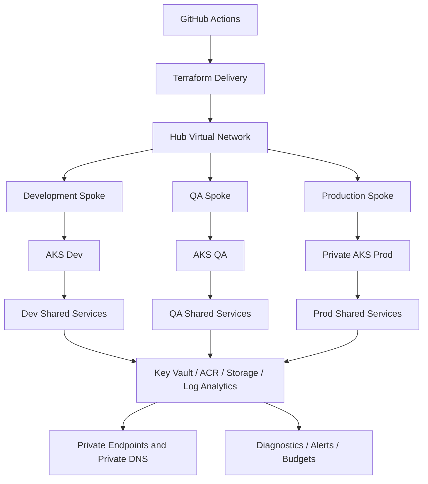
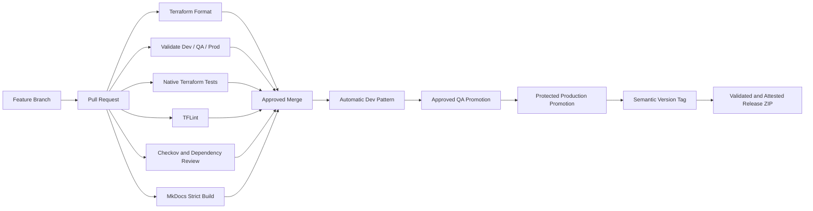

# Enterprise Azure Landing Zone Reference Architecture

[](https://github.com/harshilamin/terraform-azure-enterprise-infrastructure/actions/workflows/terraform-ci.yml)
[](https://github.com/harshilamin/terraform-azure-enterprise-infrastructure/actions/workflows/portfolio-readiness.yml)
[](https://github.com/harshilamin/terraform-azure-enterprise-infrastructure/actions/workflows/docs-pages.yml)
[](https://github.com/harshilamin/terraform-azure-enterprise-infrastructure/releases)
[](LICENSE)

A production-inspired Azure platform engineering portfolio built with Terraform.

This repository demonstrates how a senior DevOps or Platform Engineer can design, automate, secure, validate, document, and operate a multi-environment Azure landing zone.

> **Portfolio scope:** The code is designed to format, validate, test, lint, scan, and document without requiring a paid Azure deployment. Azure-authenticated plan and apply workflows remain reference implementations until OIDC federation, remote state, and environment approvals are configured.

## Architecture




## What this repository proves

| Engineering area | Repository evidence |
|---|---|
| Infrastructure as Code | 21 focused Terraform modules |
| Environment design | Independent Dev, QA, and Prod roots |
| Azure networking | Hub-and-spoke, NSGs, peering, routes, Private Link |
| Kubernetes platform | AKS, Azure CNI, autoscaling, identity, Azure RBAC |
| Identity and secrets | Managed identities, Key Vault, OIDC design |
| Shared services | ACR, Storage Account, Log Analytics |
| Observability | Diagnostic settings, Action Groups, metric alerts |
| Governance | Naming, tagging, management locks, optional budgets |
| CI/CD | PR validation, planning, promotion, release workflows |
| Quality | Terraform tests, TFLint, Checkov, pre-commit |
| Documentation | MkDocs site, runbooks, ADRs, diagrams |
| Supply-chain security | Dependabot, dependency review, release attestation |

## Environment matrix

| Capability | Dev | QA | Prod |
|---|---|---|---|
| AKS VM size | `Standard_D2s_v5` | `Standard_D2s_v5` | `Standard_D4s_v5` |
| AKS minimum nodes | 1 | 1 | 3 |
| AKS maximum nodes | 3 | 4 | 8 |
| Private AKS | No | No | Yes |
| ACR SKU | Basic | Standard | Premium |
| Storage replication | LRS | LRS | ZRS |
| Log retention | 30 days | 60 days | 90 days |
| Resource-group lock | No | No | Yes |
| Monthly budget | Optional | Optional | Optional |

## Repository structure

```text
.
├── .github/
│   ├── ISSUE_TEMPLATE/
│   ├── workflows/
│   ├── dependabot.yml
│   └── release.yml
├── diagrams/
├── docs/
│   ├── adr/
│   ├── architecture/
│   ├── cicd/
│   ├── governance/
│   ├── operations/
│   ├── portfolio/
│   ├── security/
│   ├── testing/
│   └── tooling/
├── environments/
│   ├── dev/
│   ├── qa/
│   └── prod/
├── examples/
├── modules/
├── scripts/
├── mkdocs.yml
└── README.md
```

## Implemented Terraform modules

- Naming
- Resource Group
- Virtual Network
- Subnet
- Network Security Group
- VNet Peering
- Route Table
- Private DNS Zone
- Private Endpoint
- Managed Identity
- Key Vault
- Storage Account
- Container Registry
- Log Analytics
- AKS
- Role Assignment
- Diagnostic Setting
- Action Group
- Metric Alert
- Resource Group Budget
- Management Lock

## Quick start

### Validate the full portfolio

```powershell
powershell.exe -ExecutionPolicy Bypass -File .\scripts\final-readiness.ps1
```

Bash:

```bash
chmod +x scripts/*.sh
./scripts/final-readiness.sh
```

### Run the individual layers

```powershell
terraform fmt -check -recursive
.\scripts\validate-all.ps1
.\scripts\test-modules.ps1
python -m mkdocs build --strict
```

### Preview the documentation site

```powershell
python -m pip install -r requirements-docs.txt
python -m mkdocs serve
```

Documentation site:

```text
https://harshilamin.github.io/terraform-azure-enterprise-infrastructure/
```

## Delivery model



## Security posture

- No real Azure credentials or production identifiers are committed.
- Managed identity and OIDC are preferred over stored client secrets.
- Public access is reduced through private endpoints and private DNS.
- Production uses private AKS and deletion protection.
- Pull requests run Terraform validation and security checks.
- Release ZIP files can receive GitHub artifact provenance attestations.
- Dependabot monitors GitHub Actions and Python documentation dependencies.

## Reviewer path

A hiring manager can review the project in about ten minutes:

1. Read this README.
2. Compare `environments/dev`, `environments/qa`, and `environments/prod`.
3. Inspect `modules/aks`, `modules/private-endpoint`, and `modules/diagnostic-setting`.
4. Review `.github/workflows`.
5. Read the [final walkthrough](docs/portfolio/final-walkthrough.md).
6. Use the [interview demo script](docs/portfolio/demo-script.md).

## Honest limitations

- No live Azure deployment is claimed.
- Azure Firewall and Application Gateway remain architecture extensions rather than deployed modules.
- Authenticated workflows require user-owned Azure and GitHub configuration.
- Native Terraform tests validate module logic; they do not replace live integration tests.
- This repository contains original portfolio material and no proprietary employer code.

## Release history

| Version | Capability |
|---|---|
| v1.0.0 | Repository foundation |
| v1.1.0 | Architecture and engineering standards |
| v1.2.0 | Naming and resource groups |
| v1.3.0 | Hub-and-spoke networking |
| v1.4.0 | Shared platform services |
| v1.5.0 | AKS platform |
| v1.6.0 | Monitoring and diagnostics |
| v1.7.0 | CI/CD reference workflows |
| v1.8.0 | Private networking and security |
| v1.9.0 | Operational alerts and automation |
| v2.0.0 | Integrated portfolio release |
| v2.0.1 | Governance and contribution standards |
| v2.0.2 | Quality and security tooling |
| v2.0.3 | Native tests and examples |
| v2.0.4 | MkDocs and GitHub Pages |
| v2.0.5 | Release automation |
| v2.1.0 | Final portfolio readiness release |

## Author

**Harshil Amin**
Senior DevOps Engineer
GitHub: [harshilamin](https://github.com/harshilamin)

## License

MIT
