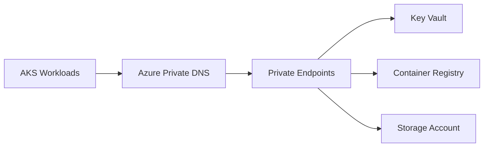

# Enterprise Azure Landing Zone Reference Architecture

## Release v1.8.0 — Private Networking and Security

This release adds private connectivity and infrastructure protection patterns:

- Reusable route-table module
- Reusable private DNS zone module
- Reusable private endpoint module
- Reusable management-lock module
- Dedicated private endpoint subnet per environment
- Private endpoints for Key Vault, Container Registry, Storage Blob, and Storage File
- Private DNS links to hub and spoke VNets
- Route-table association for workload subnets
- Production resource-group deletion lock
- Security architecture and operational documentation

## Private connectivity flow



## Validation

```bash
terraform fmt -check -recursive
terraform -chdir=environments/dev init -backend=false -reconfigure
terraform -chdir=environments/dev validate
terraform -chdir=environments/qa init -backend=false -reconfigure
terraform -chdir=environments/qa validate
terraform -chdir=environments/prod init -backend=false -reconfigure
terraform -chdir=environments/prod validate
```

## Roadmap

- [x] v1.0.0 Repository foundation
- [x] v1.1.0 Documentation and standards
- [x] v1.2.0 Naming and resource groups
- [x] v1.3.0 Hub-and-spoke networking
- [x] v1.4.0 Shared platform services
- [x] v1.5.0 AKS platform
- [x] v1.6.0 Monitoring and diagnostics
- [x] v1.7.0 CI/CD reference workflows
- [x] v1.8.0 Private networking and security
- [ ] v1.9.0 Operational alerts and automation
- [ ] v2.0.0 Integrated production release

Maintained by [Harshil Amin](https://github.com/harshilamin).
