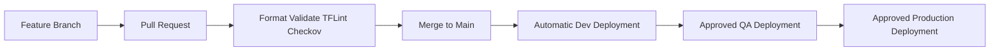

# Enterprise Azure Landing Zone Reference Architecture

## Release v1.7.0 — CI/CD Deployment Workflows

This release adds enterprise-style Terraform delivery automation:

- Pull request formatting, validation, TFLint, and Checkov
- Azure OIDC authentication without stored client secrets
- Remote AzureRM state initialization
- On-demand Terraform plan artifacts
- Automatic Development deployment after merge
- Protected QA and Production promotion
- Per-environment concurrency controls
- Deployment and rollback runbooks

## Delivery flow



## Required setup

Before running authenticated workflows:

1. Create GitHub Environments: `dev`, `qa`, and `prod`.
2. Configure required reviewers for QA and Production.
3. Configure Azure federated identity credentials for each environment.
4. Add Azure and Terraform state secrets to each GitHub Environment.
5. Confirm the Azure identity has appropriately scoped RBAC.

See:

- `docs/cicd/github-environments.md`
- `docs/cicd/azure-oidc.md`
- `docs/cicd/remote-state.md`
- `docs/operations/deployment-runbook.md`

## Local validation

```bash
terraform fmt -check -recursive
terraform -chdir=environments/dev init -backend=false -reconfigure
terraform -chdir=environments/dev validate
```

## Roadmap

- [x] v1.0.0 Repository foundation
- [x] v1.1.0 Documentation and standards
- [x] v1.2.0 Naming and resource groups
- [x] v1.3.0 Hub-and-spoke networking
- [x] v1.4.0 Shared platform services
- [x] v1.5.0 AKS platform
- [x] v1.6.0 Monitoring and diagnostics
- [x] v1.7.0 CI/CD deployment workflows
- [ ] v1.8.0 Private networking and security
- [ ] v1.9.0 Operational alerts and automation
- [ ] v2.0.0 Integrated production release

Maintained by [Harshil Amin](https://github.com/harshilamin).
