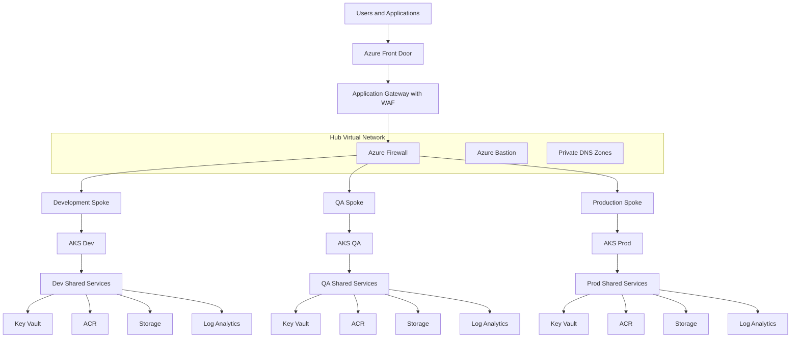
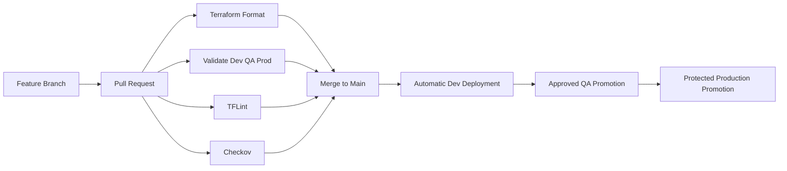

# Enterprise Azure Landing Zone Reference Architecture

[](https://developer.hashicorp.com/terraform)
[](https://azure.microsoft.com/)
[](https://github.com/features/actions)
[](https://kubernetes.io/)
[](LICENSE)
[](https://github.com/harshilamin)

A production-inspired Azure platform engineering reference implementation built with Terraform.

This repository demonstrates how a senior DevOps or Platform Engineer can structure, secure, document, validate, and operate a multi-environment Azure landing zone.

## What this project demonstrates

- Reusable Terraform module design
- Dev, QA, and Production environment separation
- Hub-and-spoke networking
- AKS platform engineering
- Managed identities and Azure RBAC
- Azure Key Vault, ACR, Storage, and Log Analytics
- Private endpoints and private DNS
- Azure Monitor diagnostics and alerts
- GitHub Actions CI/CD patterns
- OIDC-based Azure authentication design
- Remote Terraform state architecture
- Cost governance and operational automation
- Enterprise documentation and release management

This repository contains original portfolio content and does not include proprietary employer code.

## Architecture



## Repository structure

```text
.
├── .github/                 GitHub templates and workflows
├── diagrams/                Mermaid source diagrams
├── docs/                    Architecture, standards, operations, CI/CD
├── environments/
│   ├── dev/                 Development Terraform root
│   ├── qa/                  QA Terraform root
│   └── prod/                Production Terraform root
├── examples/                Standalone usage examples
├── modules/                 Reusable Terraform modules
├── scripts/                 Validation and maintenance scripts
├── Makefile                 Common engineering commands
└── README.md
```

## Implemented modules

- Naming
- Resource groups
- Virtual networks
- Subnets
- NSGs
- VNet peering
- Route tables
- Private DNS
- Private endpoints
- Managed identity
- Key Vault
- Storage Account
- Container Registry
- Log Analytics
- AKS
- Role assignments
- Diagnostic settings
- Action groups
- Metric alerts
- Resource-group budgets
- Management locks

## Environment differences

| Capability | Dev | QA | Prod |
|---|---|---|---|
| AKS VM size | Standard_D2s_v5 | Standard_D2s_v5 | Standard_D4s_v5 |
| AKS min nodes | 1 | 1 | 3 |
| AKS max nodes | 3 | 4 | 8 |
| Private AKS | No | No | Yes |
| ACR SKU | Basic | Standard | Premium |
| Storage replication | LRS | LRS | ZRS |
| Log retention | 30 days | 60 days | 90 days |
| Resource-group lock | No | No | Yes |
| Monthly budget | Optional | Optional | Optional |

## Local validation

```powershell
terraform fmt -recursive
terraform fmt -check -recursive
.\scripts\validate-all.ps1
```

Or with Bash:

```bash
chmod +x scripts/*.sh
./scripts/validate-all.sh
```

These commands initialize with `-backend=false`, so syntax validation does not require an Azure subscription.

## CI/CD model



Authenticated plan and deployment workflows are included as reference patterns. They require Azure OIDC federation, GitHub Environments, and remote-state resources before execution.

## Documentation

Start here:

- [Architecture index](docs/architecture/README.md)
- [Deployment guide](docs/getting-started/deployment-guide.md)
- [Troubleshooting guide](docs/operations/troubleshooting.md)
- [Security model](docs/security/security-model.md)
- [CI/CD overview](docs/cicd/README.md)
- [Interview talking points](docs/portfolio/interview-talking-points.md)
- [Hiring manager walkthrough](docs/portfolio/hiring-manager-walkthrough.md)

## Release history

| Version | Capability |
|---|---|
| v1.0.0 | Repository foundation |
| v1.1.0 | Documentation and standards |
| v1.2.0 | Naming and resource groups |
| v1.3.0 | Hub-and-spoke networking |
| v1.4.0 | Shared platform services |
| v1.5.0 | AKS platform |
| v1.6.0 | Monitoring and diagnostics |
| v1.7.0 | CI/CD reference workflows |
| v1.8.0 | Private networking and security |
| v1.9.0 | Operational alerts and automation |
| v2.0.0 | Integrated portfolio release |

## Author

**Harshil Amin**  
Senior DevOps Engineer  
GitHub: [harshilamin](https://github.com/harshilamin)

## License

MIT
