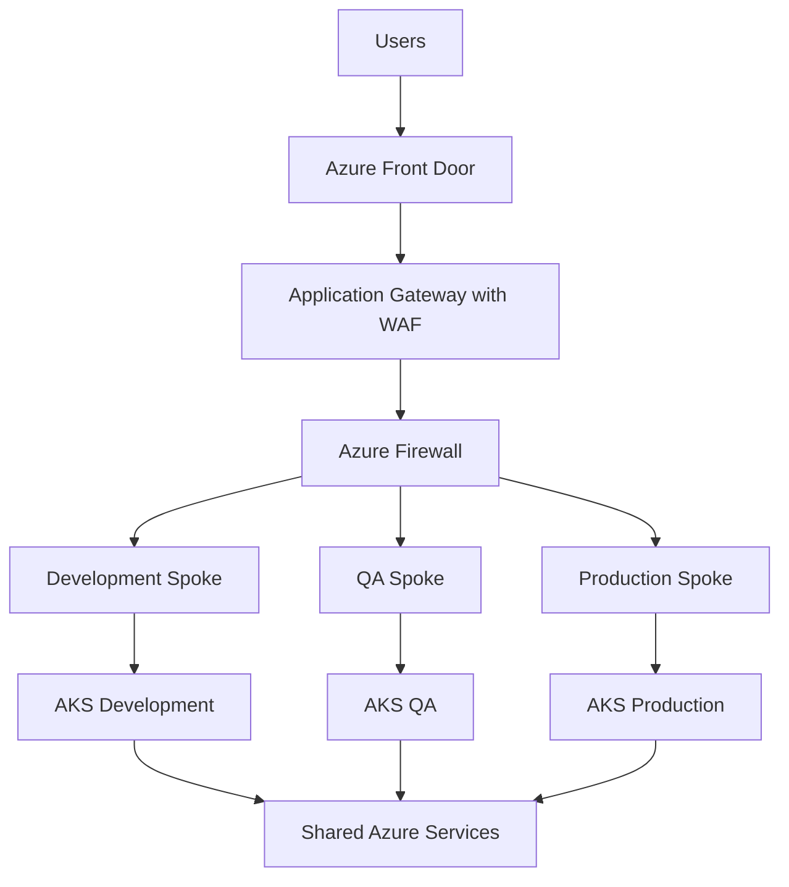

# Enterprise Azure Landing Zone Reference Architecture

[](https://developer.hashicorp.com/terraform)
[](https://azure.microsoft.com/)
[](https://github.com/features/actions)
[](LICENSE)
[](https://github.com/harshilamin)

A production-inspired Azure platform engineering reference implementation built with Terraform. It demonstrates secure multi-environment architecture, reusable infrastructure patterns, documentation standards, and professional Git workflows.

## Project purpose

This portfolio project demonstrates:

- Azure enterprise architecture
- Terraform module design
- Development, QA, and production separation
- Hub-and-spoke networking
- Security, governance, naming, and tagging standards
- GitHub pull request and validation workflows
- Infrastructure documentation and operational readiness

This repository contains original portfolio content only and does not include proprietary employer code.

## Planned architecture



## Repository structure

```text
.github/       GitHub templates and automation
.vscode/       Recommended editor configuration
diagrams/      Mermaid source diagrams
docs/          Architecture, security, and standards
environments/  Dev, QA, and Prod Terraform roots
examples/      Module usage examples
modules/       Reusable Terraform modules
scripts/       Engineering utility scripts
```

## Design principles

1. Reusable, focused modules
2. Separate state and lifecycle per environment
3. Secure-by-default networking and identity
4. Pull request validation before merge
5. Documented decisions and operational readiness
6. No secrets in source control

## Current release

### v1.1.0 — Documentation and engineering standards

Adds architecture, networking, security, Terraform standards, pre-commit hooks, Dependabot, issue forms, validation workflow, editor settings, and release guidance.

## Roadmap

- [x] v1.0.0 — Repository foundation
- [x] v1.1.0 — Documentation and engineering standards
- [ ] v1.2.0 — Resource group and naming modules
- [ ] v1.3.0 — Hub-and-spoke networking
- [ ] v1.4.0 — Key Vault, ACR, storage, and identity
- [ ] v1.5.0 — AKS platform
- [ ] v1.6.0 — Monitoring and diagnostics
- [ ] v2.0.0 — Integrated enterprise platform

## Local development

```bash
make fmt
make validate
make lint
make docs
```

## Author

**Harshil Amin** — Senior DevOps Engineer  
GitHub: [harshilamin](https://github.com/harshilamin)

## License

MIT
